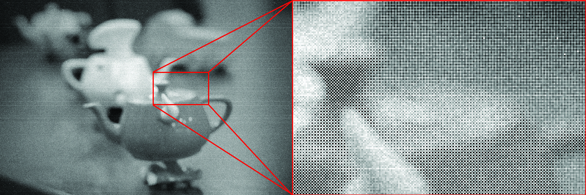
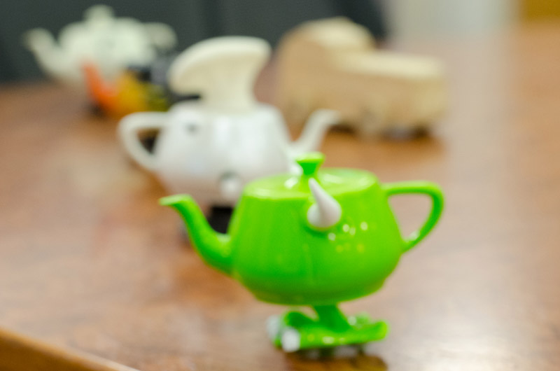

# A2: Image Processing on the kPhone 469s

In this assignment you will implement a simple image processing pipeline for the data produced by the image sensor of the much-anticipated kPhone 469s. The 469s has a camera, and your job is to process the data coming off the kPhone 469s's sensor to produce the highest quality image you can. In addition to implementing basic image processing of sensor outputs, you are also be responsible for controlling the focus of the camera.

#### A2.0 Due Date: Feb 23rd
#### A2.5 Due Date: Mar 2nd

## Getting Started

Grab the renderer starter code above. Due to use of C++11, building the code on Linux requires G++ 4.8. All Gates cluster machines had been updated to have it, but we recommend you work on the Gates 3000 machines, ghc28-49.ghc.andrew.cmu.edu.

### Linux Build Instructions

The codebase uses CMake as its cross-platform make utility. We suggest an out-of-source build using cmake, which you can perform via the following steps:

```
// 1. Create a build directory anywhere you like
mkdir build

// 2. Enter the build directory
cd build

// 3. Configure the build
cmake ..

// 4. Run the generated Makefiles
make -j
```

### Running the Pipeline

Now you can run the camera.

```
./bin/camerapipe -noiselevel 1 -verybadsensor ../scenes/scene3.bin output.bmp
```

Your camera will "take a picture" and save that picture to ```output.bmp```. The starter code is set up to simply copy the RAW data off the sensor (one byte per pixel) into the red, green, and blue channels of the output image and, as you can see below, the results are quite unsatisfactory. Color is not reproduced, the effects of Bayer filter attenuation are clearly visible, and the image has other defects like, noise, dead pixels, different pixel gains, and even subtle vignetting near the corners. A zoomed view of the region highlighted in red is shown below.



For reference, the original image looked like the image below. (Note: you are not expected to reconstruct this image perfectly. A significant amount of information is lost in the sensing process.)



Usage:

* ```-noiselevel XXX``` allows you to adjust the magnitude of noise in the sensor data (0 <= XXX <=4).
* ```-verybadsensor``` adds a particular type of defect the image output
* ```-focus XXX``` sets the default focus of the camera to XXX (in units of mm from the camera). This can be useful if you want to manually set the focus to debug your image processing pipeline on the more interesting scenes without first implementing autofocus.
* ```-help``` gives you command line help

## Part 1: RAW Image Processing

In the first part of the assignment you need to process the image data to produce an RGB image that, simply put, looks at good as you can make it. The entry point to your code should be ```CameraPipeline::TakePicture()``` in ```CameraPipeline.cpp```. This method currently acquires data from the sensor via ```sensor->ReadSensorData()```. The result is a ```Width``` by ```Height``` buffer of 8-bit sensor pixel readings (each pixel measurement is represented as an unsigned char).

You may implement this assignment in any way you wish. Certainly, you will have to demosaic the image to recover RGB values. To help, the following is the Bayer filter pattern used on the kPhone's sensor. Pixel (0,0) is the top-left of the image.


You are also responsible for handling the following artifacts:

* **noise**
* **defect pixels**
* **vignetting artifacts** 

How you solve them are up to you.

**Hints on Part 1:**

* In this part of the assignment it is likely best to start by working on images the don't require auto-focusing. These include: ```black.bin``` (an all black image), ```gray.bin``` (a 50% gray image, without defects pixels should be [128,128,128]), ```stripe.bin```, and ```tartan.bin```)
* We guarantee that pixel defects (stuck pixels, pixels with extra sensitivity) are static defects that are the same for every photograph taken by the camera. What does this suggest a simple way to "calibrate" your camera for static defects? Note that while the overall noise statistics of the sensor are the same per photograph (and will only change based on the value of ```-noiselevel```), the perturbation of individual pixel values due to noise varies per photograph (that's the nature of noise!)
* After your image processing chain is producing results that you are happy with, we encourage you to take a stab at improving the performance of your code.

## Part 2: Autofocus

In the second half of the assigment you need to implement contrast-detection autofocus. Based on analysis of regions of the sensor (notice that ```sensor->ReadSensorData()``` can return a crop window of the full sensor), you should design an algorithm that sets the camera's focus via a call to ```sensor->SetFocus()```.

As I'm sure you're well aware from your own experiences, it can be very frustrating when camera takes a long time to focus, causing you to miss a great action shot. Therefore, a good implementation of autofocus should try and make its focusing decision quickly by analyzing as few pixels as possible. Although we are not grading based on the performance of your autofocus implementation, it can be fun to design an algorithm that quickly converges to a good solution. The codebase provides autofocus statistics at the end of program execution (how many crop windows requested, how many pixels requested, etc.).

**Hints on Part 2:**

* We've provided you with a few scenes where it's not immediately clear what the "right answer" is for an autofocus system. You'll have to make some choices and assumptions about what is the best object in the scene to focus on.

## Writeup

Please write up your results with answers to the following questions.

* Q1: Describe the techniques you employed to address image quality problems of: noise, sensor defects, and vignetting
* Q2: Describe your autofocus algorithm.
* Q3: What scene objects did you choose to focus on? Why?
* Q4: What problems does sensor noise cause for autofocus?
* Q5: Does autofocusing lead to blurrier scenes? In what cases? How can we combat this?
* Q6: Does scene4 cause your autofocus system problems? How does this situation remind you of experiences with a real camera?
* Q7: What is an easy way to calibrate an image on a camera for dead pixels? For vignetting? Is there a way to do this by taking a picture?
* Q8: How would you implement white balance into your image?
* Q9: Given a video and the accelerameter data associated with the video (you may assume very small hand jitters when recording), how would you use it to demosiac? Does this provide better results than a single image demosiac?
* Q10: Describe any additional optimizations or features you added to the camera pipeline.

## Grading

This assignment is not graded on wall-clock performance, only image quality. (However, we reserve the right to grudgingly take points off if your autofocus implementation is shockingly brute force or naive.) A reasonable implementation will address mosaicing, pixel defects, noise, and lens vignetting and produce a good-quality image using the ```-verybadsensor -noiselevel 1``` settings. (We don't have a numeric definition of good since there is no precise right answer... it's a photograph, you'll know a good one when you see it.) Of course, we will be more impressed if you are able to robustly handling higher noise settings. 

Performance optimizations of the image processing pipeline and autofocus algorithms is not required, but will be rewarded.

```
Task            Points
==========================
Part1           40pts
Part2           30pts
Writeup         30pts
Perf (EC)       5pts
               ===========
               105/100pts
```

## Handin

For the code, hand in the ```CameraPipeline``` directory of your modified source tree. We should be able to build and run the code on Andrew Linux machines by dropping your ```CameraPipeline``` directory into a freshly checked out tree.

```
tar -czf handin.tar CameraPipeline
```

#### For the A2.0 submission, please submit your Part1 code to Autolab.

#### For the A2.5 submission, please submit your complete code to Autolab + writeup to Gradescope.
